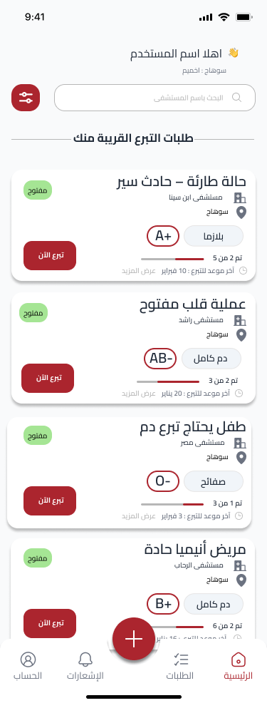
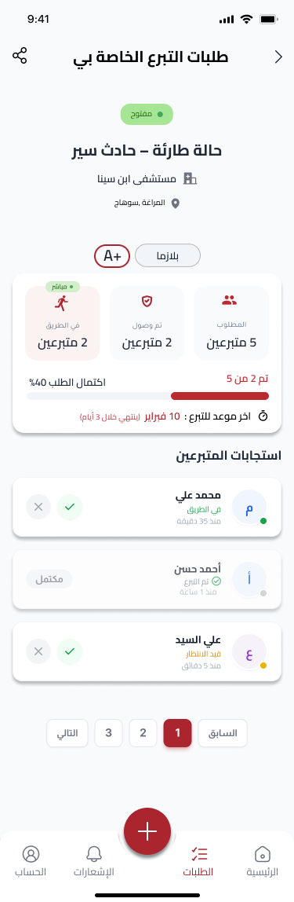
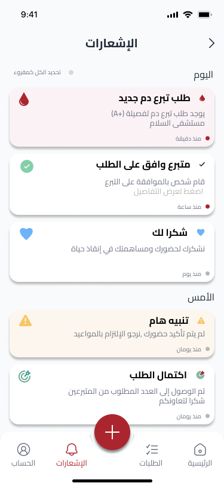
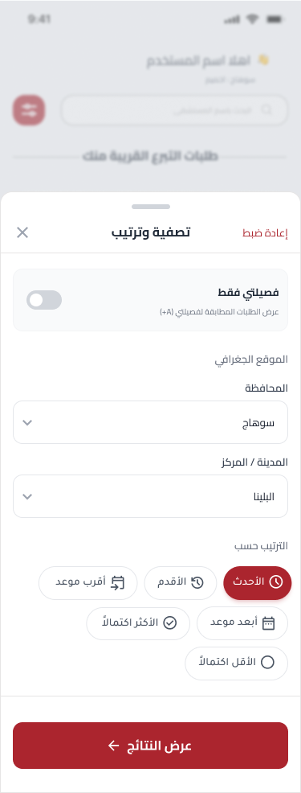
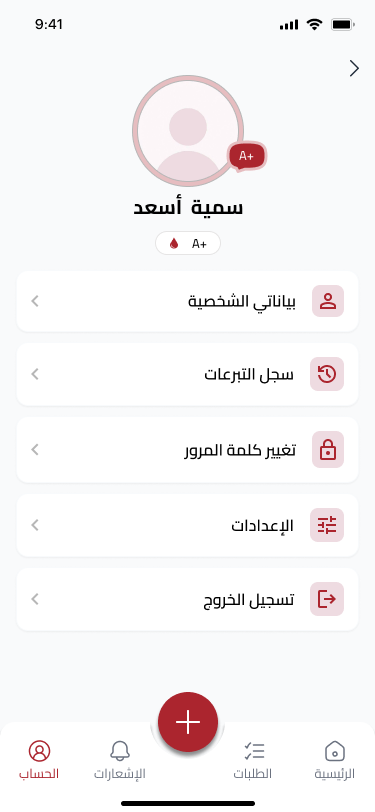

# Blood Donation

A Flutter mobile app that connects donors with patients in need by letting users create blood requests, discover nearby requests, and coordinate donations through real-time updates and notifications.

## Project Overview

Blood Donation is a feature-rich, Arabic-friendly app focused on the blood-donation journey. It helps users:

- Publish urgent blood requests with required details.
- Browse and respond to requests near their location.
- Track request status, donor responses, and donation history.
- Receive notifications and navigate directly to request details.

## Tech Stack

- Flutter, Dart
- State management: flutter_bloc
- Networking: Dio
- Dependency injection: get_it
- Routing: go_router
- Local storage: shared_preferences, hive_flutter
- Location: geolocator, location
- Realtime updates: signalr_netcore
- Firebase: firebase_core, firebase_auth, firebase_messaging
- UI/UX helpers: awesome_dialog, modal_progress_hud_nsn, pinput
- Localization: intl
- Sharing/links: url_launcher

## Architecture

- Feature-first structure under `lib/features`.
- Each feature follows a layered style (data, domain, presentation).
- Shared services and utilities live in `lib/core`.
- DI via `get_it`, wiring done in `main.dart`.
- Bloc/Cubit for state management across screens.

## Features

- Authentication (including Google sign-in)
- Onboarding and splash flow
- Create blood request
- Browse and filter requests
- Request details with status tracking
- My requests with pagination and responses
- Donation history
- Notifications and deep-link navigation
- Profile and personal data management
- Arabic-first UI with custom Cairo font

## Testing

- `flutter_test` is configured in `dev_dependencies`.
- Unit/widget tests are not yet added.

## Folder Structure

```
assets/
  images/
  fonts/
android/
ios/
lib/
  core/
  features/
    add_request/
    auth/
    donation_history/
    home/
    my_requests/
    notifications/
    onboarding/
    personal_data/
    profile/
    request_details/
    splash/
  generated/
  main.dart
web/
windows/
macos/
linux/
```

## How to Run the Project

1. Install Flutter SDK and ensure `flutter doctor` passes.
2. Get packages:
   ```bash
   flutter pub get
   ```
3. Configure Firebase:
   - Place `google-services.json` in `android/app/`.
   - Place `GoogleService-Info.plist` in `ios/Runner/`.
4. Run the app:
   ```bash
   flutter run
   ```

## Future Improvements

- Add comprehensive unit/widget tests
- Add analytics and crash reporting
- Improve offline caching for requests
- Enhance accessibility and localization coverage
- Add share/copy utilities across request flows

## Screenshots

| Onboarding 1                                             | Onboarding 2                                             | Onboarding 3                                             |
| -------------------------------------------------------- | -------------------------------------------------------- | -------------------------------------------------------- |
|  |  |  |

| Onboarding 4                                             | Splash                                              | Home                                   |
| -------------------------------------------------------- | --------------------------------------------------- | -------------------------------------- |
|  |  |  |

| Requests                                       | Request Details                                                | Notifications                                           |
| ---------------------------------------------- | -------------------------------------------------------------- | ------------------------------------------------------- |
|  |  |  |

| Filtration                                         | Profile                                      |     |
| -------------------------------------------------- | -------------------------------------------- | --- |
|  |  |     |

## Social Links

- GitHub: https://github.com/ZiadSala7/
- LinkedIn: https://www.linkedin.com/in/ziad-salah-338378262/
- Email: mailto:zslah1935@gmail.com
